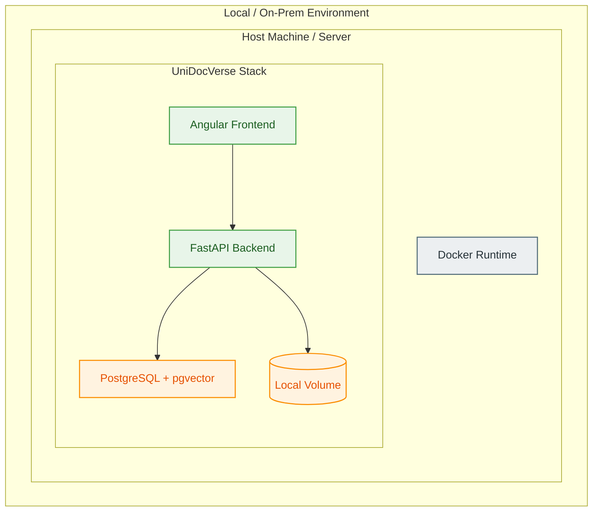

# Deployment Guide 

### Local, On‑Prem

UniDocVerse is designed for flexible deployment across:

- Developer laptops  
- On‑prem servers
- Private clouds  
- Docker‑based clusters  

---

# 1. Deployment Architecture

# Cross‑Platform Packaging Plan  
A clean, professional roadmap for delivering UniDocVerse as a native, offline‑ready application across macOS, Windows, and Linux.

---

# 🍎 1. macOS Build (.app + .dmg)

You will get:

- A native **UniDocVerse.app**
- A **double‑clickable launcher**
- A **.dmg installer** with drag‑to‑Applications support

### Inside the `.app` bundle:

### The launcher will:

- Start embedded PostgreSQL  
- Run migrations  
- Start backend  
- Start frontend  
- Open browser  

### Tools used:

- `appify` or a custom shell launcher  
- `create-dmg` for packaging  
- Optional: **Platypus** for a polished GUI wrapper  

---

# 🪟 2. Windows Build (.exe Installer)

You will get:

- A native **UniDocVerse.exe**
- A Windows installer (**NSIS** or **Inno Setup**)
- A Start Menu shortcut
- Optional: background service wrapper

### Inside the install directory:

### The launcher will:

- Start embedded PostgreSQL (Windows binaries)  
- Run migrations  
- Start backend (python.exe inside venv)  
- Start frontend (serve dist)  
- Open browser  

### Tools used:

- **Inno Setup** (recommended)  
- Or **NSIS**  
- Optional: **PyInstaller** to wrap backend launcher into an `.exe`  

---

# 🐧 3. Linux Build (AppImage)

You will get:

- A single portable **UniDocVerse.AppImage**
- No installation required
- Works on Ubuntu, Fedora, Arch, etc.

### Inside the AppImage:

### Tools used:

- `appimagetool`
- `linuxdeploy`
